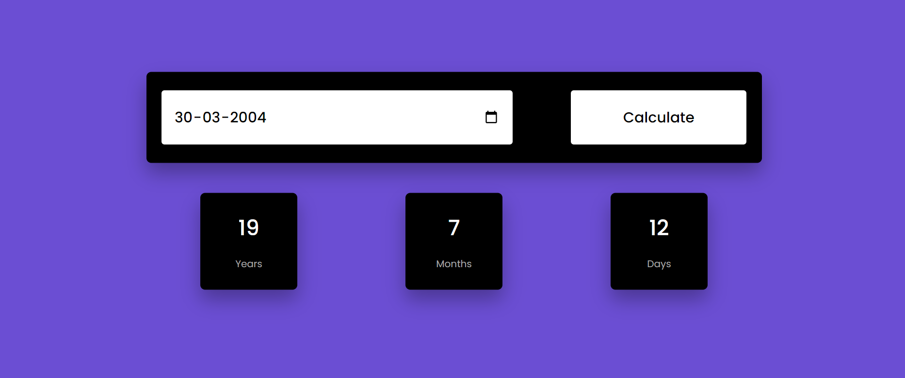

# Age Calculator

Welcome to the Age Calculator repository! This project is a JavaScript-based web application designed to calculate age based on the entered birthdate. Built with HTML, CSS, and JavaScript, it features a modern UI design for an intuitive user experience.

## Preview

## Features

- **Interactive UI:** Sleek and user-friendly interface for ease of use.
- **Birthdate Input:** Enter the birthdate using a date picker or manual input.
- **Age Calculation:** Instantly calculate and display the age based on the provided birthdate.

## Usage

1. Enter the birthdate using the date picker or manually input it.
2. Click the "Calculate Age" button.
3. The project will display the calculated age.

## Customization

Feel free to customize this project to fit your preferences. Update styles, colors, and layout in the HTML and CSS files. You can also extend the functionality to include additional features or customization options.

## Contributing

If you'd like to contribute to this project, please follow these steps:

1. Fork the repository.
2. Create a new branch for your feature or improvement.
3. Make your changes and commit them with descriptive messages.
4. Push your changes to your forked repository.
5. Open a pull request to merge your changes into the main branch.

Explore the Age Calculator, calculate ages effortlessly, and consider contributing to its development. Thank you for checking out the repository!